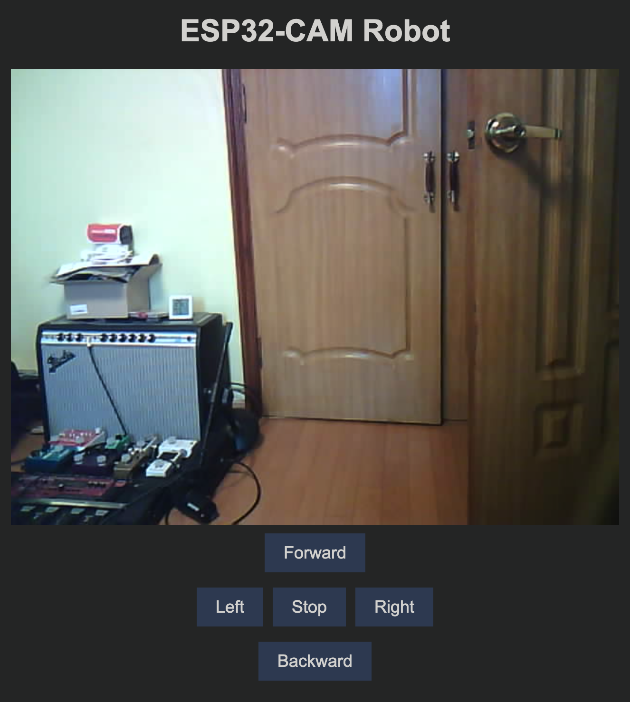
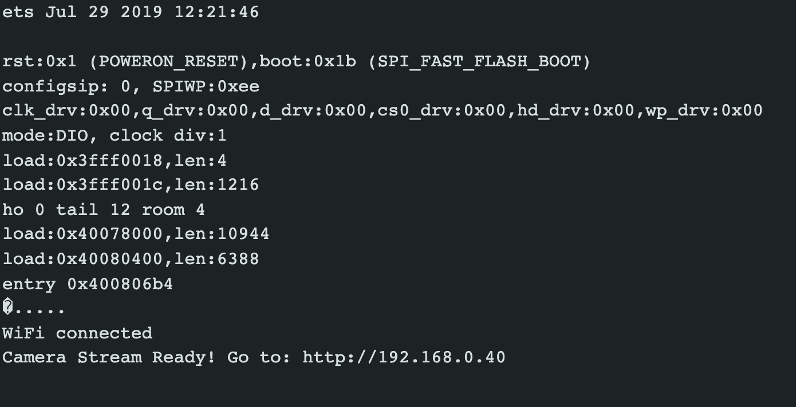

# Web Server for ESP32-CAM + Motor Controller

<p align="center">
  
</p>

The above screenshot is an example of the web server interface that this code sample generates. Full tutorial [here](https://randomnerdtutorials.com/esp32-cam-car-robot-web-server/) is available for more information.

In the `Car_Robot_Camera_Web_Server.ino` file, which is downloaded from the full tutorial link above, a couple of things are to be modified. First, your WiFi configurations:

``` C++
        // Replace with your network credentials
        const char* ssid = "REPLACE_WITH_YOUR_SSID";
        const char* password = "REPLACE_WITH_YOUR_PASSWORD";
```

Next is the pin numbers that are being used for your hardware configuration. The below changes are already made in the committed code:

``` C++
        define MOTOR_1_PIN_1    15
        define MOTOR_1_PIN_2    13
        define MOTOR_2_PIN_1    14
        define MOTOR_2_PIN_2    2
```

Using ArduinoIDE, flash the `Car_Robot_Camera_Web_Server.ino` file to your ESP32-CAM device using standard methods. Once you reset your device, the serial monitor will display the IP address required to connect to the web server hosted by your ESP32-CAM. Example below:

<p align="center">
  
</p>

Make sure you are connected to the same WiFi network specified in the `.ino` file above, and use your browser to connect to the web server. 